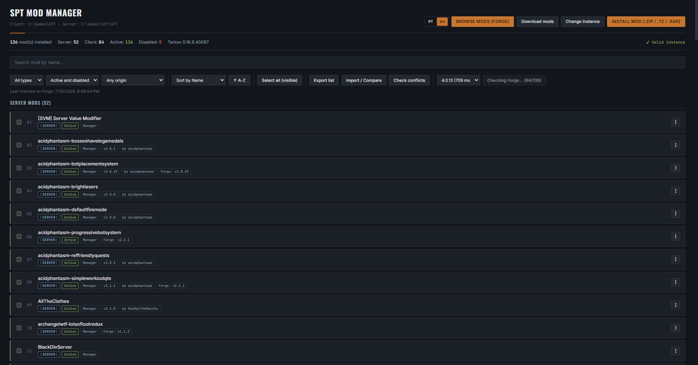
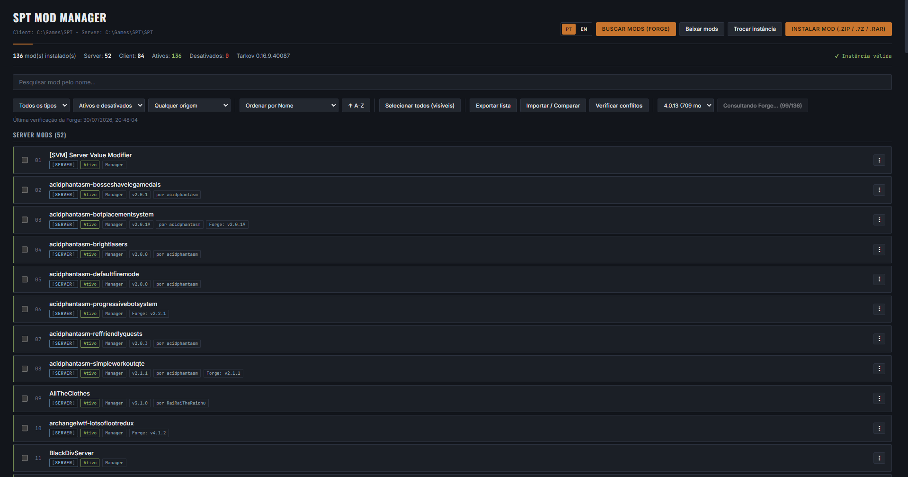

# SPTarky Mod Manager — Spicy Edition

**v1.0.0** · A **Vortex / Mod Organizer 2**-style mod manager built specifically for **Single Player Tarkov (SPT)**.

A desktop app (Electron + React + TypeScript) that installs, organizes, enables/disables and removes mods without manually messing with folders — while staying compatible with mods you already installed by hand.

Styled with its own "tactical manifest" look — condensed headers, monospace technical data, a warm accent colour — rather than a generic dark-mode template.

> ⚠️ Personal project, not affiliated with the SPT team or Battlestate Games. Tarkov and Escape from Tarkov are trademarks of their respective owners. ⚠️

---

## Credits — with thanks to TioEmir

This is a fork of **[SPT Mod Manager](https://github.com/Nevek20/SPT_Mod_Manager)** by **Matheus Guida (TioEmir)**, released under the MIT licence.

The original is not a starting point that got replaced — it *is* this application. The installer and its structure detection, the package handling that keeps a mod's client and server halves together, the orphan-file manifest, the conflict detection, the zip-slip hardening, the whole interface and its look: all of that is his work, still here, still doing the heavy lifting. This fork changes how mods are matched against Forge and little else. Every hour spent on it was spent standing on a codebase that already worked.

It is also unusually well documented internally. The original carries dense comments explaining not just what the code does but *why* — which real installation broke it, which assumption turned out false, what was tried and abandoned. Those notes made this work possible: several fixes here exist only because a comment recorded a measurement someone had already taken the trouble to make. That is rare, and it deserves saying.

**If you want the original, get it from [Nevek20/SPT_Mod_Manager](https://github.com/Nevek20/SPT_Mod_Manager).** It is actively maintained; this fork is not a replacement for it and does not track its releases. Bugs here are this fork's — please do not report them upstream.

---

## What's different in this fork

| | Original behaviour | Here |
|---|---|---|
| Mod → Forge matching | name-derived, fuzzy | GUID-first, read from CLI metadata |
| Match rate (54-mod reference install) | 27/53 (51%) | **54/54 (100%)** |
| Wrong matches | ~4, silently presented as correct | 0, with guesses flagged for confirmation |
| Mods with no readable version | 13 of 54 | **0 of 54** |
| Language | pt-BR + English | English only |

The headline fix: the update check sent `filter[include_legacy]` alongside every other filter, and Forge's API silently ignores all other filters when that flag is present — returning the unfiltered catalogue with HTTP 200. That killed GUID batching, ID-cache batching and name lookup at once, leaving only a last-resort full-text search. See `electron/modManager.ts` for the measured evidence.

Beyond that:

- **Mod identity is read, not guessed.** A PE/CLI metadata parser reads the `BepInPlugin` attribute (client mods) and the `AbstractModMetadata` constructor (server mods) directly from the assembly, rather than scanning DLLs for plausible-looking strings. String scanning could not tell a mod's own GUID from a dependency's.
- **Nothing is asserted that isn't known.** Every match records *how* it was made — `manual`, `guid`, `cached-id`, `name`, `sibling`, `fuzzy` — and anything unverified is surfaced as "needs confirmation" rather than presented as fact. Guesses are never cached.
- **Manual override.** Any mod can be pinned to a Forge entry by hand. A pin outranks all automatic matching and is never overwritten.
- **"Already have it."** Some authors ship a new build without bumping the version inside the files, so the app offers an update you already have. Dismissing it is per-version: a later release reappears.
- **Versions have a fallback chain** — declared → package sibling → assembly version — so a mod that declares nothing still participates in update checking, tagged with where the version came from.
- **A Forge catalogue archive**, harvested before the platform's shutdown. See below.

---

## ⚠️ Forge is shutting down on 12 August 2026

Every Forge-backed feature — update checking, catalogue browsing, one-click install, modlist restore — stops working on that date.

The mapping from an installed mod to its source repository exists **only** in the Forge API and cannot be rebuilt afterwards, so it has been captured: [`data/forge-directory.json`](data/forge-directory.json) holds all **2,389 mods** with their Forge id, GUID, owner and source URL.

Measured coverage (full harvest, 2026-08-05):

| Slice | Has a source link |
|---|---|
| Mods installed on the reference setup | 36 / 36 (100%) |
| Top 200 by downloads | 165 / 200 (83%) |
| All 2,389 | 1,450 (61%) |

93% of those links are GitHub. The catalogue-wide figure is dominated by old abandoned mods; for mods people actually run, coverage is close to total.

Full analysis, and what survives the shutdown, in **[docs/FORGE-SHUTDOWN.md](docs/FORGE-SHUTDOWN.md)**.

---

## Features

**Installation**
- Install from `.zip`, `.7z`, or `.rar`, via file picker or drag-and-drop
- Automatic structure detection — works even when the mod is wrapped in extra folders (e.g. `SPT/user/mods/ModName/...`)
- Type detection: Server, Client, or Hybrid
- Post-install verification: checks file by file that everything copied before reporting success
- Unrecognised archive structures prompt for confirmation, showing the archive's root contents, rather than failing silently or guessing

**Organization**
- Enable/disable without deleting (moves between the active folder and a `.disabled` one), cascading across a mod's client and server halves and its prepatchers
- Rename a mod's display name without touching any file
- Distinguishes mods installed by the app from ones dropped in by hand
- Export/import mod lists, with a diff against what's installed and optional auto-download of what's missing
- Loose files with no folder of their own are tracked through a manifest and remain cleanly removable

**Forge integration**
- Update checking with per-mod status: update available, blocked by a dependency conflict, incompatible with your SPT version, or needs confirmation
- Search/browse the Forge catalogue in-app and install in one click
- SPT version picker sourced from Forge's own list
- Resolved identifiers cached per instance, so later checks are near-instant

**Reliability**
- Conflict detection: duplicate DLL names across client mods, and duplicate GUIDs across server mods
- SPT version detection from the instance itself
- Local SPT-compatibility checking read from each mod's own files — works with no network at all, and keeps working after Forge is gone
- Archive entries validated before extraction (`.7z`, `.rar`) or sanitised during it (`.zip`), rejecting anything trying to write outside the target
- SPT's own core client files are never listed or touched as if they were mods, even under "select all + remove"

**Finding what you need**
- Real-time search, filters by type/status/origin, sorting, multi-select with bulk actions and Shift+Click ranges

---

## Screenshots




---

## Getting Started

### Prerequisites
- [Node.js](https://nodejs.org/) 18 or later (developed against 24 LTS)
- Windows — the app assumes Windows-style SPT conventions; untested elsewhere
- An existing SPT instance

### Development

```bash
git clone https://github.com/cspicer5/SPTarky-Mod-Manager-Spicy.git
cd SPTarky-Mod-Manager-Spicy
npm install
npm run electron:dev
```

`npm install` will report that `electron` and `esbuild` have install scripts pending — both need theirs (they download the Electron runtime and the esbuild binary). Approve with `npm approve-scripts electron esbuild`.

For UI-only iteration, `npm run dev` runs Vite alone. In that mode `window.modManagerAPI` does not exist, so anything touching the backend fails — it is for visuals only.

### Auditing Forge matching

```bash
npm run audit:forge -- "D:\SPT"
```

Runs the real matching code against an install and reports what resolved, by which method, and what did not. Read-only by default; `--write` also persists the resolved identifiers to the match cache.

### Building

```bash
npx electron-builder --win dir "-c.win.signAndEditExecutable=false"
```

Produces a portable folder in `release/win-unpacked`.

**Why not `npm run electron:build`?** On Windows, electron-builder extracts a `winCodeSign` bundle containing macOS `.dylib` symlinks, which Windows refuses to create without Developer Mode or elevation — the build fails there before it reaches packaging. The command above skips the signing path entirely. Icon and version metadata can then be applied directly:

```bash
rcedit "release/win-unpacked/SPTarky Mod Manager Spicy.exe" --set-icon build/icon.ico
```

(`rcedit-x64.exe` lives in electron-builder's `winCodeSign` cache.)

---

## Project structure

```
SPTarky-Mod-Manager-Spicy/
├── electron/
│   ├── main.ts          # Electron window + IPC handlers
│   ├── preload.ts       # exposes window.modManagerAPI (contextIsolation)
│   ├── modManager.ts    # filesystem logic, Forge integration, matching
│   ├── peMetadata.ts    # PE/CLI metadata reader (mod identity from assemblies)
│   └── types.ts         # shared types, Electron side
├── src/
│   ├── App.tsx          # the whole React UI
│   ├── App.css          # styles
│   ├── i18n.ts          # UI strings (English only)
│   └── types.ts         # types + the preload API surface
├── scripts/
│   ├── audit-forge-match.js       # measures match rate against a real install
│   └── harvest-forge-directory.js # captures the Forge catalogue
├── data/
│   └── forge-directory.json       # 2,389 mods, archived pre-shutdown
└── docs/
    └── FORGE-SHUTDOWN.md          # what breaks, what survives, V2 options
```

---

## How it works under the hood

### Folder conventions
| What | Where |
|---|---|
| Active server mods | `<instance>/user/mods/` |
| Disabled server mods | `<instance>/user/mods.disabled/` |
| Active client mods | `<instance>/BepInEx/plugins/` |
| Disabled client mods | `<instance>/BepInEx/plugins.disabled/` |

Split installs (client and server in different folders, as SPT 4.x's installer can produce) are detected and handled.

### Control files (at the instance root)
- `.spt-mod-manager-registry.json` — which mods the app installed, plus what Forge reported at the time
- `.spt-mod-manager-aliases.json` — custom display names
- `.spt-mod-manager-manifest.json` — loose files belonging to a mod but living outside its folder
- `.spt-mod-manager-forge-match.json` — cached Forge identifiers **with provenance** (v2 format; v1 files are discarded on read, since their entries record no evidence of how they were derived)
- `.spt-mod-manager-forge-dismissed.json` — updates dismissed as "already have it"

### Identifying a mod

In order of trustworthiness:

1. **Manual pin** — the user said so. Final.
2. **GUID** — read from the assembly's `BepInPlugin` attribute (client) or `AbstractModMetadata` constructor (server). Exact, and Forge accepts GUIDs in comma-separated batches, so dozens of mods resolve in one request.
3. **Cached ID** — resolved by an earlier run, re-validated.
4. **Published name** — an exact match, or one confirmed by the author.
5. **Full-text search** — a guess. Flagged for confirmation, never cached.

A mod that resolves by none of these can still inherit a match from another part of the same installed package, since the halves of one mod are the same Forge entry.

Matching always uses the folder-derived name, never a display alias, so renaming for your own organisation cannot break it.

### Versions

SPT 4.0 moved mod metadata out of `package.json` and into the assembly. Version is read in this order, and tagged with which applied:

1. **Declared** by the mod itself
2. **Sibling** — the other half of the same package, which ships at the same version
3. **Assembly** — `AssemblyInformationalVersion`. Last resort: an author who never bumps their assembly leaves it stale, and one mod was found declaring `0.0.1.0` while shipping as 2.0.0

### Rate limits

Forge allows 40 requests / 10s (burst) and 200 / 60s (sustained), per IP. The app paces under that and honours `Retry-After`. These limits are real — probing harder during development earned a Cloudflare block on the whole IP, not merely a 429.

With GUID batching working, a 54-mod install resolves in roughly 3 requests and about 16 seconds.

---

## Known limitations

- **Orphan (merge-installed) mods** support only rename/remove — there is no folder of their own to move.
- **"Reinstall"** opens the file picker; the original archive is not retained (see the roadmap note on why).
- **Conflict detection is file-level**, not semantic — it catches duplicate DLLs and duplicate GUIDs, not two mods fighting over the same loot table.
- **Server-mod `Version` is not read directly.** SPT types it as a `SemanticVersioning.Version` object rather than a string, and the value is not recoverable from the constructor IL the way the other fields are. The sibling and assembly fallbacks cover this in practice, but a version obtained that way is inferred.
- **Forge search filtering by SPT version filters the mod, not each version** — check the SPT constraint shown next to a version before installing.
- **A borrowed sibling version assumes both halves ship together.** True in every case observed, but it is an inference.
- Only tested on Windows.

---

## Roadmap

**Done in this fork**
- [x] Fixed the `include_legacy` bug that disabled every identity filter
- [x] PE/CLI metadata parser — mod identity read from assemblies rather than guessed
- [x] Match provenance and a "needs confirmation" state
- [x] Manual Forge pin, and per-version update dismissal
- [x] Sibling propagation for both identity and version
- [x] Forge catalogue archived ahead of the shutdown
- [x] `audit:forge` harness, so match-rate claims are measured rather than asserted
- [x] English-only; backend message translation layer removed

**Next — post-shutdown (V2)**
- [ ] GitHub releases backend for update checking, seeded from the harvested directory
- [ ] GitHub token support (60 req/hr unauthenticated vs 5,000 with a token — the difference between unusable and trivial), stored via Electron `safeStorage` rather than plaintext config
- [ ] Add-your-own entries for mods with no harvested source link (~8% of what people actually install)
- [ ] Decide what happens to catalogue browsing and one-click install once Forge is gone

**Still open**
- [ ] Read server-mod `Version` directly from the constructor IL, removing the fallback
- [ ] Deeper conflict detection (two mods editing the same loot table)
- [ ] Linux/macOS support

**Considered and rejected**
- *Retaining the original archive for reinstall* — doubles disk usage for every mod installed. Re-prompting is the better trade.
- *Forge API tokens* — the API is open and read-only; authentication does nothing. A bogus bearer token returns the same rate limit as none.

---

## Contributing

Personal project. Issues and PRs welcome; open an issue first for anything large.

## License

[MIT](LICENSE) — retaining the original copyright of Matheus Guida (TioEmir) as the licence requires, with this fork's alongside.

`.rar` extraction is powered by [node-unrar-js](https://github.com/YuJianrong/node-unrar.js), a WASM build of the official UnRAR source — free to use but under its own licence (not MIT); see that package's `LICENSE.md`.
